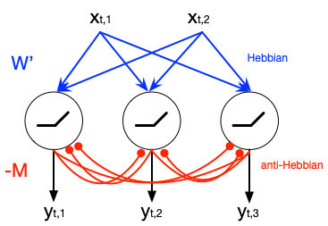
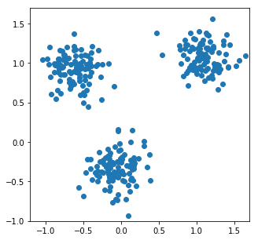
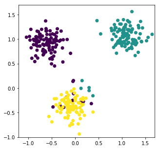

# Hebbian/Anti-Hebbian Network for Online NMF

A third-party reimplementation of the paper: *"A Hebbian/Anti-Hebbian Network Derived from Online Non-Negative Matrix Factorization Can Cluster and Discover Sparse Features"* by Cengiz Pehlevan and Dmitri B. Chklovskii

[https://arxiv.org/abs/1503.00680](https://arxiv.org/abs/1503.00680)

## Network

## Result

Input:

Clustering output:

